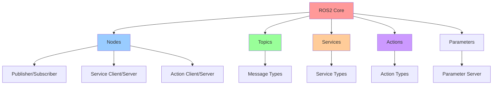
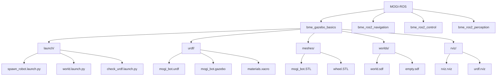
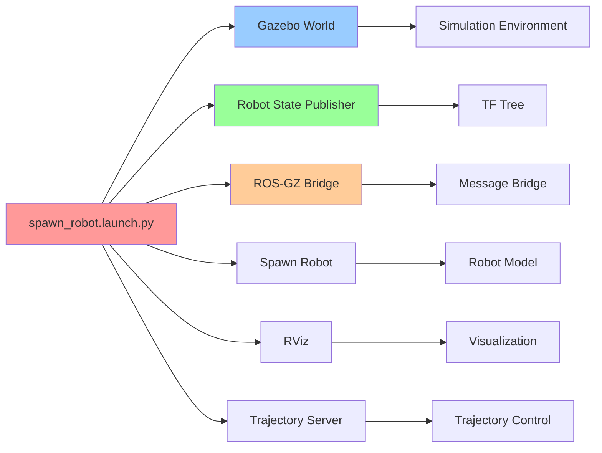

<p align="center">English | <a href="./MOGI-ROS.md">Español</a> </p>

# MOGI-ROS Crash Course: Installation, Execution and Exploration

## 📋 Table of Contents

1. [Introduction to MOGI-ROS](#introduction-to-mogi-ros)
2. [ROS2 Theoretical Concepts](#ros2-theoretical-concepts)
3. [Installation and Configuration](#installation-and-configuration)
4. [Project Structure](#project-structure)
5. [Execution and Simulation](#execution-and-simulation)
6. [Component Exploration](#component-exploration)
7. [Development Tools](#development-tools)
8. [Troubleshooting](#troubleshooting)

---

## 🚀 Introduction to MOGI-ROS

MOGI-ROS is an educational framework developed for the robotics course at BME University (Budapest University of Technology and Economics). It provides a solid foundation for learning ROS2 with Gazebo simulation.

**🔗 Original Repository:** [https://github.com/huyth-vgu/MOGI-ROS](https://github.com/huyth-vgu/MOGI-ROS)

### Main Features

| Feature | Description |
|---------|-------------|
| **Mobile Robot** | Differential robot with mecanum and skid-steer wheels |
| **Gazebo Simulation** | Realistic physics simulation environment |
| **RViz Visualization** | Integrated visualization tools |
| **Autonomous Navigation** | Navigation and SLAM capabilities |
| **Modular** | Modular and extensible architecture |

---

## 🧠 ROS2 Theoretical Concepts

### ROS2 Architecture



### Main Components

| Component | Function | Example in MOGI-ROS |
|-----------|----------|---------------------|
| **Nodes** | Processing units | `robot_state_publisher`, `mogi_trajectory_server` |
| **Topics** | Asynchronous communication | `/cmd_vel`, `/odom`, `/joint_states` |
| **Services** | Synchronous communication | `/spawn`, `/kill` |
| **Actions** | Long-duration tasks | Navigation, manipulation |
| **Parameters** | Dynamic configuration | Robot parameters |
| **TF** | Coordinate transformations | `base_link` → `left_wheel` |

### Common Message Types

| Message Type | Description | Usage |
|--------------|-------------|-------|
| `geometry_msgs/Twist` | Linear and angular velocity | Motion control |
| `nav_msgs/Odometry` | Position and orientation | Robot odometry |
| `sensor_msgs/JointState` | Joint states | Wheel positions |
| `tf2_msgs/TFMessage` | Transformations | Coordinate system |

---

## ⚙️ Installation and Configuration

### System Requirements

| Requirement | Minimum Version | Description |
|-------------|-----------------|-------------|
| **Ubuntu** | 22.04 LTS | Recommended operating system |
| **ROS2** | Jazzy | Robotics framework |
| **Gazebo** | Harmonic | Physics simulator |
| **Python** | 3.10+ | Programming language |
| **Git** | Latest version | Version control |

### Installation Steps

#### 1. Install ROS2 Jazzy

```bash
# Configure repositories
sudo apt update && sudo apt install software-properties-common
sudo add-apt-repository universe
sudo apt update && sudo apt install curl -y
sudo curl -sSL https://raw.githubusercontent.com/ros/rosdistro/master/ros.key -o /usr/share/keyrings/ros-archive-keyring.gpg
echo "deb [arch=$(dpkg --print-architecture) signed-by=/usr/share/keyrings/ros-archive-keyring.gpg] http://packages.ros.org/ros2/ubuntu $(. /etc/os-release && echo $UBUNTU_CODENAME) main" | sudo tee /etc/apt/sources.list.d/ros2.list > /dev/null

# Install ROS2 Jazzy
sudo apt update
sudo apt install ros-jazzy-desktop

# Configure environment
echo "source /opt/ros/jazzy/setup.bash" >> ~/.bashrc
source ~/.bashrc
```

#### 2. Install Gazebo Harmonic

```bash
# Install Gazebo Harmonic
sudo apt update
sudo apt install gz-harmonic

# Verify installation
gz sim --version
```

#### 3. Install Dependencies

```bash
# Install development tools
sudo apt install python3-colcon-common-extensions python3-rosdep python3-argcomplete

# Initialize rosdep
sudo rosdep init
rosdep update
```

#### 4. Clone and Compile MOGI-ROS

```bash
# Create workspace
mkdir -p ~/ros2_ws/src
cd ~/ros2_ws/src

# Clone repository
git clone https://github.com/huyth-vgu/MOGI-ROS.git

# Install dependencies
cd ~/ros2_ws
rosdep install --from-paths src --ignore-src -r -y

# Compile
colcon build

# Configure environment
source install/setup.bash
```

### Installation Verification

```bash
# Verify ROS2
ros2 --version

# Verify Gazebo
gz sim --version

# Verify MOGI-ROS packages
ros2 pkg list | grep bme
```

---

## 📁 Project Structure

### General Architecture



### Directory Structure

| Directory | Content | Purpose |
|-----------|---------|---------|
| **`launch/`** | Launch files | Node configuration |
| **`urdf/`** | Robot description | Physical and visual model |
| **`meshes/`** | 3D models | Robot geometry |
| **`worlds/`** | Simulation environments | Gazebo scenarios |
| **`rviz/`** | RViz configurations | Visualization |
| **`config/`** | Parameters | Node configuration |
| **`scripts/`** | Python code | Control logic |

### Key Files

| File | Type | Description |
|------|------|-------------|
| `package.xml` | Metadata | Package information |
| `CMakeLists.txt` | Build | Compilation configuration |
| `spawn_robot.launch.py` | Launch | Main launch file |
| `mogi_bot.urdf` | URDF | Robot description |
| `world.sdf` | SDF | Simulation world |

---

## 🎮 Execution and Simulation

### Basic Launch

```bash
# Navigate to workspace
cd ~/ros2_ws

# Configure environment
source install/setup.bash

# Launch basic simulation
ros2 launch bme_gazebo_basics spawn_robot.launch.py
```

### Launch Options

| Parameter | Default Value | Description |
|-----------|---------------|-------------|
| `rviz` | `true` | Open RViz |
| `world` | `world.sdf` | World file |
| `model` | `mogi_bot.urdf` | Robot model |

### Launch Examples

```bash
# Launch without RViz
ros2 launch bme_gazebo_basics spawn_robot.launch.py rviz:=false

# Launch with empty world
ros2 launch bme_gazebo_basics spawn_robot.launch.py world:=empty.sdf

# Launch with specific model
ros2 launch bme_gazebo_basics spawn_robot.launch.py model:=mogi_bot_mecanum.urdf
```

### Running Nodes



---

## 🔍 Component Exploration

### Node Interaction

```mermaid
graph TB
    A[Gazebo Simulator] --> B[ROS-GZ Bridge]
    B --> C[Robot State Publisher]
    B --> D[Trajectory Server]
    
    E[RViz] --> C
    F[User Commands] --> D
    
    C --> G[TF Tree]
    D --> H[Robot Control]
    
    B --> I[/cmd_vel]
    B --> J[/odom]
    B --> K[/joint_states]
    B --> L[/tf]
    
    style A fill:#ff9999
    style B fill:#99ccff
    style C fill:#99ff99
    style D fill:#ffcc99
```

### Main Topics

| Topic | Type | Description | Publisher | Subscriber |
|-------|------|-------------|-----------|------------|
| `/cmd_vel` | `geometry_msgs/Twist` | Velocity commands | Controller | Gazebo |
| `/odom` | `nav_msgs/Odometry` | Robot odometry | Gazebo | Navigation |
| `/joint_states` | `sensor_msgs/JointState` | Joint states | Gazebo | RViz |
| `/tf` | `tf2_msgs/TFMessage` | Transformations | Robot State Publisher | RViz |
| `/clock` | `rosgraph_msgs/Clock` | Simulation time | Gazebo | All |

### Available Services

| Service | Type | Description |
|---------|------|-------------|
| `/spawn` | `gazebo_msgs/SpawnEntity` | Create entities |
| `/kill` | `gazebo_msgs/DeleteEntity` | Delete entities |
| `/get_model_state` | `gazebo_msgs/GetModelState` | Get state |
| `/set_model_state` | `gazebo_msgs/SetModelState` | Set state |

### Exploration Commands

```bash
# List active nodes
ros2 node list

# List topics
ros2 topic list

# Monitor messages
ros2 topic echo /cmd_vel
ros2 topic echo /odom
ros2 topic echo /joint_states

# View node information
ros2 node info /robot_state_publisher

# View parameters
ros2 param list /robot_state_publisher

# Connection graph
rqt_graph
```

---

## 🛠️ Development Tools

### RViz - Visualization

```bash
# Launch RViz
rviz2

# Launch with specific configuration
ros2 run rviz2 rviz2 -d ~/ros2_ws/src/MOGI-ROS/bme_gazebo_basics/rviz/rviz.rviz
```

### rqt - GUI Tools

| Tool | Command | Purpose |
|------|---------|---------|
| **rqt_graph** | `rqt_graph` | Connection graph |
| **rqt_tf_tree** | `ros2 run rqt_tf_tree rqt_tf_tree` | Transformation tree |
| **rqt_plot** | `rqt_plot` | Data plots |
| **rqt_reconfigure** | `rqt_reconfigure` | Dynamic configuration |

### Gazebo - Simulation

```bash
# Launch Gazebo
gz sim

# Launch with specific world
gz sim ~/ros2_ws/src/MOGI-ROS/bme_gazebo_basics/worlds/world.sdf

# Launch with alternative rendering
gz sim --render-engine ogre
```

### Useful Commands

```bash
# Check robot state
ros2 topic echo /odom

# Send movement commands
ros2 topic pub /cmd_vel geometry_msgs/msg/Twist "{linear: {x: 0.5, y: 0.0, z: 0.0}, angular: {x: 0.0, y: 0.0, z: 0.0}}"

# View transformations
ros2 run tf2_tools view_frames

# Save map (if available)
ros2 run nav2_map_server map_saver_cli -f ~/saved_map
```

---

## 🔧 Troubleshooting

### Common Problems

| Problem | Cause | Solution |
|---------|-------|----------|
| **Gazebo won't start** | GPU issues | `gz sim --render-engine ogre` |
| **Nodes not found** | Environment not configured | `source ~/ros2_ws/install/setup.bash` |
| **Compilation errors** | Missing dependencies | `rosdep install --from-paths src --ignore-src -r -y` |
| **Topics don't appear** | Nodes not started | Verify nodes are running |
| **TF errors** | Missing transformations | Verify `robot_state_publisher` |

### Diagnostic Commands

```bash
# Verify ROS2 installation
ros2 --version

# Verify Gazebo installation
gz sim --version

# Verify packages
ros2 pkg list | grep bme

# Verify dependencies
rosdep check bme_gazebo_basics

# View error logs
ros2 run rqt_console rqt_console
```

### Debugging

```bash
# Run with detailed information
ros2 launch bme_gazebo_basics spawn_robot.launch.py --debug

# View node information
ros2 node info /robot_state_publisher

# View parameters
ros2 param list /robot_state_publisher

# View services
ros2 service list
```

---

## 📚 Additional Resources

### Official Documentation

| Resource | Link | Description |
|----------|------|-------------|
| **ROS2 Documentation** | https://docs.ros.org/en/jazzy/ | Official ROS2 documentation |
| **Gazebo Documentation** | https://gazebosim.org/docs/harmonic/ | Gazebo manual |
| **URDF Tutorial** | http://wiki.ros.org/urdf/Tutorials | URDF tutorials |
| **Launch Files** | https://docs.ros.org/en/jazzy/Guides/Launch-files.html | Launch files guide |

### Community and Support

| Resource | Link | Description |
|----------|------|-------------|
| **ROS Answers** | https://answers.ros.org/ | Q&A forum |
| **ROS Discourse** | https://discourse.ros.org/ | ROS community |
| **GitHub Issues** | https://github.com/huyth-vgu/MOGI-ROS/issues | Report issues |

### Next Steps

1. **Experiment with different models**: Try `mogi_bot_mecanum.urdf` and `mogi_bot_skid_steer.urdf`
2. **Create custom worlds**: Modify `.sdf` files in `worlds/`
3. **Add sensors**: Integrate cameras, lasers, etc.
4. **Implement navigation**: Use Nav2 for autonomous navigation
5. **Develop controllers**: Create custom control nodes

---

## 🎯 Conclusion

MOGI-ROS provides a solid foundation for learning ROS2 and mobile robotics. With this guide, you should be able to:

- ✅ Install and configure the environment
- ✅ Launch basic simulations
- ✅ Explore the system architecture
- ✅ Use development tools
- ✅ Solve common problems

You're now ready to start your robotics journey with MOGI-ROS!

---

*Last updated: July 2025*
*Version: 1.0*
