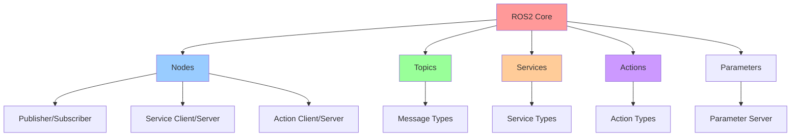
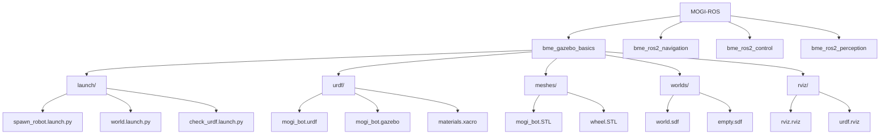
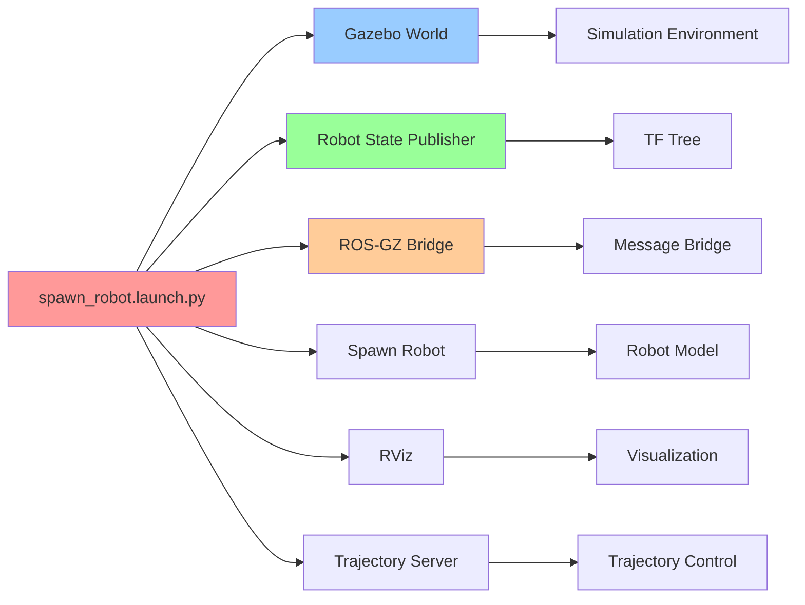

<p align="center"><a href="./MOGI-ROS-en.md">English</a> | Español </p>

# Curso Intensivo MOGI-ROS: Instalación, Ejecución y Exploración

## 📋 Tabla de Contenidos

1. [Introducción a MOGI-ROS](#introducción-a-mogi-ros)
2. [Conceptos Teóricos de ROS2](#conceptos-teóricos-de-ros2)
3. [Instalación y Configuración](#instalación-y-configuración)
4. [Estructura del Proyecto](#estructura-del-proyecto)
5. [Ejecución y Simulación](#ejecución-y-simulación)
6. [Exploración de Componentes](#exploración-de-componentes)
7. [Herramientas de Desarrollo](#herramientas-de-desarrollo)
8. [Solución de Problemas](#solución-de-problemas)

---

## 🚀 Introducción a MOGI-ROS

MOGI-ROS es un framework educativo desarrollado para el curso de robótica de la Universidad BME (Budapest University of Technology and Economics). Proporciona una base sólida para aprender ROS2 con simulación en Gazebo.

**🔗 Repositorio Original:** [https://github.com/huyth-vgu/MOGI-ROS](https://github.com/huyth-vgu/MOGI-ROS)

### Características Principales

| Característica | Descripción |
|----------------|-------------|
| **Robot Móvil** | Robot diferencial con ruedas mecanum y skid-steer |
| **Simulación Gazebo** | Entorno de simulación física realista |
| **Visualización RViz** | Herramientas de visualización integradas |
| **Navegación Autónoma** | Capacidades de navegación y SLAM |
| **Modular** | Arquitectura modular y extensible |

---

## 🧠 Conceptos Teóricos de ROS2

### Arquitectura de ROS2



### Componentes Principales

| Componente | Función | Ejemplo en MOGI-ROS |
|------------|---------|---------------------|
| **Nodes** | Unidades de procesamiento | `robot_state_publisher`, `mogi_trajectory_server` |
| **Topics** | Comunicación asíncrona | `/cmd_vel`, `/odom`, `/joint_states` |
| **Services** | Comunicación síncrona | `/spawn`, `/kill` |
| **Actions** | Tareas de larga duración | Navegación, manipulación |
| **Parameters** | Configuración dinámica | Parámetros del robot |
| **TF** | Transformaciones de coordenadas | `base_link` → `left_wheel` |

### Tipos de Mensajes Comunes

| Tipo de Mensaje | Descripción | Uso |
|-----------------|-------------|-----|
| `geometry_msgs/Twist` | Velocidad lineal y angular | Control de movimiento |
| `nav_msgs/Odometry` | Posición y orientación | Odometría del robot |
| `sensor_msgs/JointState` | Estados de articulaciones | Posición de ruedas |
| `tf2_msgs/TFMessage` | Transformaciones | Sistema de coordenadas |

---

## ⚙️ Instalación y Configuración

### Requisitos del Sistema

| Requisito | Versión Mínima | Descripción |
|-----------|----------------|-------------|
| **Ubuntu** | 22.04 LTS | Sistema operativo recomendado |
| **ROS2** | Jazzy | Framework de robótica |
| **Gazebo** | Harmonic | Simulador de física |
| **Python** | 3.10+ | Lenguaje de programación |
| **Git** | Última versión | Control de versiones |

### Pasos de Instalación

#### 1. Instalar ROS2 Jazzy

```bash
# Configurar repositorios
sudo apt update && sudo apt install software-properties-common
sudo add-apt-repository universe
sudo apt update && sudo apt install curl -y
sudo curl -sSL https://raw.githubusercontent.com/ros/rosdistro/master/ros.key -o /usr/share/keyrings/ros-archive-keyring.gpg
echo "deb [arch=$(dpkg --print-architecture) signed-by=/usr/share/keyrings/ros-archive-keyring.gpg] http://packages.ros.org/ros2/ubuntu $(. /etc/os-release && echo $UBUNTU_CODENAME) main" | sudo tee /etc/apt/sources.list.d/ros2.list > /dev/null

# Instalar ROS2 Jazzy
sudo apt update
sudo apt install ros-jazzy-desktop

# Configurar entorno
echo "source /opt/ros/jazzy/setup.bash" >> ~/.bashrc
source ~/.bashrc
```

#### 2. Instalar Gazebo Harmonic

```bash
# Instalar Gazebo Harmonic
sudo apt update
sudo apt install gz-harmonic

# Verificar instalación
gz sim --version
```

#### 3. Instalar Dependencias

```bash
# Instalar herramientas de desarrollo
sudo apt install python3-colcon-common-extensions python3-rosdep python3-argcomplete

# Inicializar rosdep
sudo rosdep init
rosdep update
```

#### 4. Clonar y Compilar MOGI-ROS

```bash
# Crear espacio de trabajo
mkdir -p ~/ros2_ws/src
cd ~/ros2_ws/src

# Clonar repositorio
git clone https://github.com/huyth-vgu/MOGI-ROS.git

# Instalar dependencias
cd ~/ros2_ws
rosdep install --from-paths src --ignore-src -r -y

# Compilar
colcon build

# Configurar entorno
source install/setup.bash
```

### Verificación de Instalación

```bash
# Verificar ROS2
ros2 --version

# Verificar Gazebo
gz sim --version

# Verificar paquetes MOGI-ROS
ros2 pkg list | grep bme
```

---

## 📁 Estructura del Proyecto

### Arquitectura General



### Estructura de Directorios

| Directorio | Contenido | Propósito |
|------------|-----------|-----------|
| **`launch/`** | Archivos de lanzamiento | Configuración de nodos |
| **`urdf/`** | Descripción del robot | Modelo físico y visual |
| **`meshes/`** | Modelos 3D | Geometría del robot |
| **`worlds/`** | Entornos de simulación | Escenarios de Gazebo |
| **`rviz/`** | Configuraciones RViz | Visualización |
| **`config/`** | Parámetros | Configuración de nodos |
| **`scripts/`** | Código Python | Lógica de control |

### Archivos Clave

| Archivo | Tipo | Descripción |
|---------|------|-------------|
| `package.xml` | Metadatos | Información del paquete |
| `CMakeLists.txt` | Build | Configuración de compilación |
| `spawn_robot.launch.py` | Launch | Lanzamiento principal |
| `mogi_bot.urdf` | URDF | Descripción del robot |
| `world.sdf` | SDF | Mundo de simulación |

---

## 🎮 Ejecución y Simulación

### Lanzamiento Básico

```bash
# Navegar al espacio de trabajo
cd ~/ros2_ws

# Configurar entorno
source install/setup.bash

# Lanzar simulación básica
ros2 launch bme_gazebo_basics spawn_robot.launch.py
```

### Opciones de Lanzamiento

| Parámetro | Valor por Defecto | Descripción |
|-----------|-------------------|-------------|
| `rviz` | `true` | Abrir RViz |
| `world` | `world.sdf` | Archivo de mundo |
| `model` | `mogi_bot.urdf` | Modelo del robot |

### Ejemplos de Lanzamiento

```bash
# Lanzar sin RViz
ros2 launch bme_gazebo_basics spawn_robot.launch.py rviz:=false

# Lanzar con mundo vacío
ros2 launch bme_gazebo_basics spawn_robot.launch.py world:=empty.sdf

# Lanzar con modelo específico
ros2 launch bme_gazebo_basics spawn_robot.launch.py model:=mogi_bot_mecanum.urdf
```

### Nodos que se Ejecutan



---

## 🔍 Exploración de Componentes

### Interacción de Nodos

```mermaid
graph TB
    A[Gazebo Simulator] --> B[ROS-GZ Bridge]
    B --> C[Robot State Publisher]
    B --> D[Trajectory Server]
    
    E[RViz] --> C
    F[User Commands] --> D
    
    C --> G[TF Tree]
    D --> H[Robot Control]
    
    B --> I[/cmd_vel]
    B --> J[/odom]
    B --> K[/joint_states]
    B --> L[/tf]
    
    style A fill:#ff9999
    style B fill:#99ccff
    style C fill:#99ff99
    style D fill:#ffcc99
```

### Tópicos Principales

| Tópico | Tipo | Descripción | Publisher | Subscriber |
|--------|------|-------------|-----------|------------|
| `/cmd_vel` | `geometry_msgs/Twist` | Comandos de velocidad | Controlador | Gazebo |
| `/odom` | `nav_msgs/Odometry` | Odometría del robot | Gazebo | Navegación |
| `/joint_states` | `sensor_msgs/JointState` | Estados de articulaciones | Gazebo | RViz |
| `/tf` | `tf2_msgs/TFMessage` | Transformaciones | Robot State Publisher | RViz |
| `/clock` | `rosgraph_msgs/Clock` | Tiempo de simulación | Gazebo | Todos |

### Servicios Disponibles

| Servicio | Tipo | Descripción |
|----------|------|-------------|
| `/spawn` | `gazebo_msgs/SpawnEntity` | Crear entidades |
| `/kill` | `gazebo_msgs/DeleteEntity` | Eliminar entidades |
| `/get_model_state` | `gazebo_msgs/GetModelState` | Obtener estado |
| `/set_model_state` | `gazebo_msgs/SetModelState` | Establecer estado |

### Comandos de Exploración

```bash
# Listar nodos activos
ros2 node list

# Listar tópicos
ros2 topic list

# Monitorear mensajes
ros2 topic echo /cmd_vel
ros2 topic echo /odom
ros2 topic echo /joint_states

# Ver información de nodo
ros2 node info /robot_state_publisher

# Ver parámetros
ros2 param list /robot_state_publisher

# Gráfico de conexiones
rqt_graph
```

---

## 🛠️ Herramientas de Desarrollo

### RViz - Visualización

```bash
# Lanzar RViz
rviz2

# Lanzar con configuración específica
ros2 run rviz2 rviz2 -d ~/ros2_ws/src/MOGI-ROS/bme_gazebo_basics/rviz/rviz.rviz
```

### rqt - Herramientas GUI

| Herramienta | Comando | Propósito |
|-------------|---------|-----------|
| **rqt_graph** | `rqt_graph` | Gráfico de conexiones |
| **rqt_tf_tree** | `ros2 run rqt_tf_tree rqt_tf_tree` | Árbol de transformaciones |
| **rqt_plot** | `rqt_plot` | Gráficos de datos |
| **rqt_reconfigure** | `rqt_reconfigure` | Configuración dinámica |

### Gazebo - Simulación

```bash
# Lanzar Gazebo
gz sim

# Lanzar con mundo específico
gz sim ~/ros2_ws/src/MOGI-ROS/bme_gazebo_basics/worlds/world.sdf

# Lanzar con renderizado alternativo
gz sim --render-engine ogre
```

### Comandos Útiles

```bash
# Verificar estado del robot
ros2 topic echo /odom

# Enviar comandos de movimiento
ros2 topic pub /cmd_vel geometry_msgs/msg/Twist "{linear: {x: 0.5, y: 0.0, z: 0.0}, angular: {x: 0.0, y: 0.0, z: 0.0}}"

# Ver transformaciones
ros2 run tf2_tools view_frames

# Guardar mapa (si está disponible)
ros2 run nav2_map_server map_saver_cli -f ~/mapa_guardado
```

---

## 🔧 Solución de Problemas

### Problemas Comunes

| Problema | Causa | Solución |
|----------|-------|----------|
| **Gazebo no inicia** | Problemas de GPU | `gz sim --render-engine ogre` |
| **Nodos no encontrados** | Entorno no configurado | `source ~/ros2_ws/install/setup.bash` |
| **Errores de compilación** | Dependencias faltantes | `rosdep install --from-paths src --ignore-src -r -y` |
| **Tópicos no aparecen** | Nodos no iniciados | Verificar que los nodos estén ejecutándose |
| **Errores TF** | Transformaciones faltantes | Verificar `robot_state_publisher` |

### Comandos de Diagnóstico

```bash
# Verificar instalación ROS2
ros2 --version

# Verificar instalación Gazebo
gz sim --version

# Verificar paquetes
ros2 pkg list | grep bme

# Verificar dependencias
rosdep check bme_gazebo_basics

# Ver logs de errores
ros2 run rqt_console rqt_console
```

### Debugging

```bash
# Ejecutar con información detallada
ros2 launch bme_gazebo_basics spawn_robot.launch.py --debug

# Ver información de nodo
ros2 node info /robot_state_publisher

# Ver parámetros
ros2 param list /robot_state_publisher

# Ver servicios
ros2 service list
```

---

## 📚 Recursos Adicionales

### Documentación Oficial

| Recurso | Enlace | Descripción |
|---------|--------|-------------|
| **ROS2 Documentation** | https://docs.ros.org/en/jazzy/ | Documentación oficial ROS2 |
| **Gazebo Documentation** | https://gazebosim.org/docs/harmonic/ | Manual de Gazebo |
| **URDF Tutorial** | http://wiki.ros.org/urdf/Tutorials | Tutoriales URDF |
| **Launch Files** | https://docs.ros.org/en/jazzy/Guides/Launch-files.html | Guía de archivos launch |

### Comunidad y Soporte

| Recurso | Enlace | Descripción |
|---------|--------|-------------|
| **ROS Answers** | https://answers.ros.org/ | Foro de preguntas |
| **ROS Discourse** | https://discourse.ros.org/ | Comunidad ROS |
| **GitHub Issues** | https://github.com/huyth-vgu/MOGI-ROS/issues | Reportar problemas |

### Próximos Pasos

1. **Experimentar con diferentes modelos**: Probar `mogi_bot_mecanum.urdf` y `mogi_bot_skid_steer.urdf`
2. **Crear mundos personalizados**: Modificar archivos `.sdf` en `worlds/`
3. **Añadir sensores**: Integrar cámaras, láseres, etc.
4. **Implementar navegación**: Usar Nav2 para navegación autónoma
5. **Desarrollar controladores**: Crear nodos de control personalizados

---

## 🎯 Conclusión

MOGI-ROS proporciona una base sólida para aprender ROS2 y robótica móvil. Con esta guía, deberías poder:

- ✅ Instalar y configurar el entorno
- ✅ Lanzar simulaciones básicas
- ✅ Explorar la arquitectura del sistema
- ✅ Usar herramientas de desarrollo
- ✅ Solucionar problemas comunes

¡Ahora estás listo para comenzar tu viaje en robótica con MOGI-ROS!

---

*Última actualización: Julio 2025*
*Versión: 1.0*